# Defect detection

## Разработка системы обнаружения и классификации дефектов на упаковках груза 

Система обнаружения дефектов на упаковочных коробках разрабатывается для автоматизации процессов обработки поступающего на склад груза и сокращения финансовых потерь, возникающих вследствие повреждений товаров и связанных с возвратами и выплатами штрафов. Нарушения целостности упаковки указывают на потенциальное повреждение груза внутри. Вместе с тем, выявление подобных дефектов является лишь косвенным индикатором повреждения товара, поэтому потребуется последующая ручная верификация. 

Тем не менее, внедрение автоматизированной системы обнаружения повреждений груза по внешнему виду упаковки с использованием технологий компьютерного зрения существенно повысит эффективность работы склада за счет сокращения временных и финансовых ресурсов, затрачиваемых на обработку дефектных коробок (минимизация расходов на возвратную логистику и сокращение общих операционных затрат по сравнению с визуальной оценкой сохранности упаковки сотрудниками). 

Для внедрения предлагаемой системы достаточно оборудовать зону приемки склада камерами видеонаблюдения, установив их над двумя конвейерными лентами. 

В рамках системы решаются две задачи для обнаружения и классификации дефектов на упаковочных коробках:

1.	Задача распознавания коробок.
2.	Задача распознавания и последующей классификации дефектов на найденных коробках.
   
Задачи распознавания рассматриваются как задачи инстанс сегментации, а не детекции. Выбор такого подхода обусловлен тем, что сегментационные маски, в отличие от ограничительных рамок, исключают влияние фона при распознавании. Это повышает качество распознавания и последующей классификации дефектов.

Для решения поставленных задач предлагается двухстадийная система, состоящая из двух последовательных сегментаторов. Первый сегментатор системы определяет на изображении местоположение коробки, затем коробка вырезается из изображения, что позволяет исключить влияние фона, и после применяется второй сегментатор для поиска и классификации самих дефектов. 

Преимущества и недостатки двухстадийной системы обнаружения дефектов на упаковках
| Преимущества | Недостатки |
|-------------|-------------|
| -	автоматическое распознавание коробок и локализация заданных типов дефектов;   | -	сложность системы в связи с использованием двух сегментаторов;    | 
| -	исключение влияния фона, локализация дефектов исключительно на упаковке;    | -	сложность подготовки данных для обучения нейросетевых алгоритмов.    | 
| -	распознавание дефектов коробок в режиме реального времени;    |     | 
| -	отсутствие необходимости использования мощных вычислительных ресурсов.    |     | 

### Сбор и подготовка данных для обучения алгоритмов системы 

Было собрано и подготовлено два набора данных для обучения алгоритмов компьютерного зрения под каждую из задач.

#### Набор данных для распознавания коробок

Датасет структурирован следующим образом: 
- изображения из открытых наборов данных (TAMPAR, Parcel2D, AISS-CV) и поисковых сервисов (Картинки Google, Яндекс Картинки);
- кадры видеозаписей с передвигающимися по конвейерным лентам коробками (каждый 10-й кадр);
- самостоятельно подготовленные данные (каждый 10-й кадр видео коробок с разных ракурсов). 

Итоговый датасет содержит изображения различного разрешения и качества, среди которых присутствуют изображения как с одной коробкой, так и с несколькими, а также негативные примеры – изображения, не содержащие коробок. 

  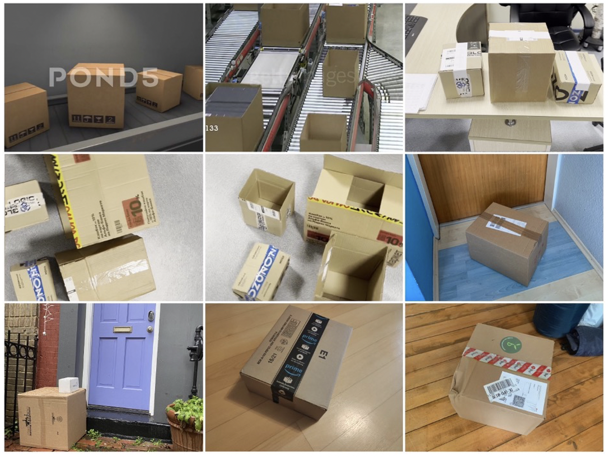

Структура датасета:

  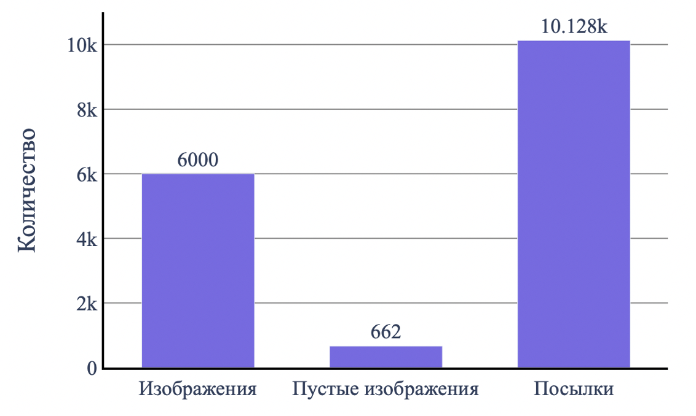

Поскольку предоставленные в открытых датасетах аннотации объектов ограничивались только ограничительными рамками, была проведена переразметка собранных данных с помощью полуавтоматического метода кликовой интерактивной сегментации. Алгоритм позволяет пользователю формировать бинарные маски для объектов интереса при помощи двух видов кликов: положительный клик используется для выделения целевого объекта маской, отрицательный – для корректировки контуров маски в случае захвата фона.

Пример работы алгоритма кликовой интерактивной сегментации:

  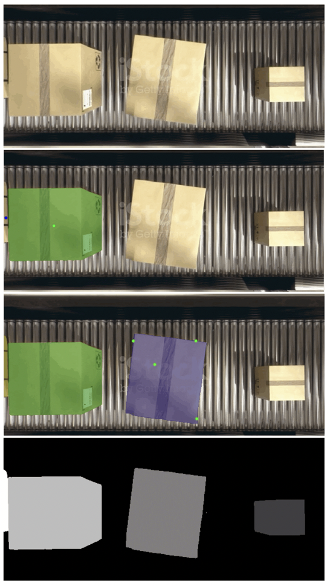

А) Исходное изображение, Б) Создание сегментационной маски для первой коробки с помощью 1 положительного клика (зеленая точка) и 1 отрицательного (синяя точка), В) Создание сегментационной маски для второй коробки с помощью 4 положительных кликов, Г) Результирующая бинарная маска инстансов 

Аналогичным образом была проведена разметка кадров из видео с передвигающимися по конвейерным лентам коробками и самостоятельно отснятых видео коробок.

Преимущество полуавтоматического метода разметки перед полностью ручным методом заключается в сокращении временных затрат и трудовых ресурсов, необходимых для получения качественной разметки. 

#### Набор данных для распознавания и классификации дефектов на коробках

Датасет целиком сформирован из самостоятельно подготовленных данных. 

Процесс формирования датасета включал видеосъемку коробок с предварительно нанесенными на них тремя видами дефектов – «отверстие», «открытая коробка», «вмятина». После получения кадров, производилась разметка коробок на них аналогично тому, как это происходило при подготовке датасета для распознавания коробок. Затем коробки вырезались из изображений по границам сегментационных масок, и дефекты коробок на полученных кропах размечались также с помощью кликовой интерактивной сегментации. 

Примеры размеченных кропов (столбец 1 – «отверстие», столбец 2 – «открытая коробка», столбец 3 – «вмятина»):

  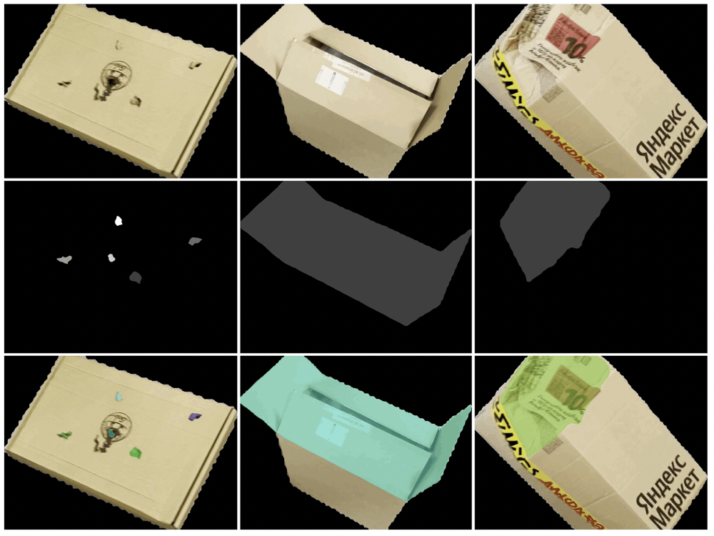

А) Исходное изображение вырезанной коробки, Б) Бинарные маски дефектов, В) Изображение коробки с выделенным дефектом

Структура датасета:

  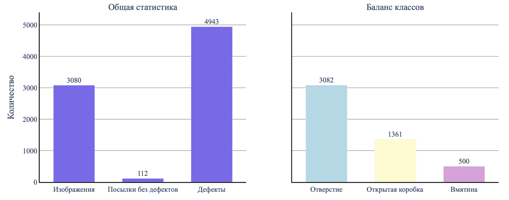

 

Выраженный дисбаланс классов является одним из существенных недостатков подготовленного датасета и может оказывать негативное влияние на эффективность процесса обучения алгоритмов классификации.

### Обучение и настройка алгоритмов сегментации и классификации 

#### Обучение YOLOv8 для распознавания коробок

Подготовленные данные были разбиты на две выборки – обучающую и валидационную в соотношении 80:20 (4 823 изображений в обучающей выборке, 1 177 – в валидационной). После чего на видеокарте Tesla A100 40 Гб было обучено 5 моделей сегментации YOLOv8, отличающихся размером архитектуры.

Гиперпараметры обучения (одинаковые для всех моделей):
| Гиперпараметр | Значение |
|-------------|-------------|
| Количество эпох обучения   | 30    | 
| Размер батча   | 48    | 
| Размер изображений после приведения   | 640x640    | 

Графики обучения (функция потерь):

  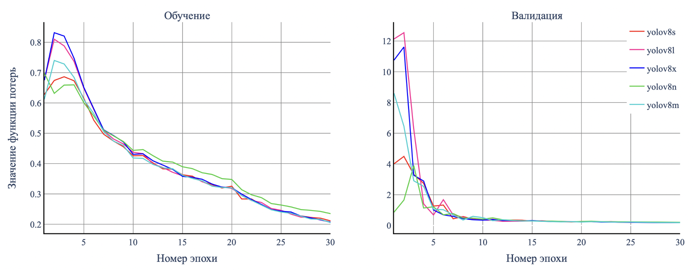

  

Графики обучения (метрики качества):

  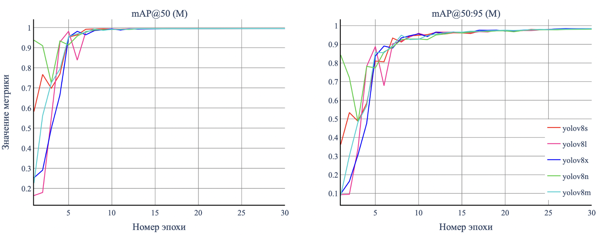

 

Наименьшее значение функции потерь (0.1846) и вторые по величине метрики качества (mAP@50 = 99.49%, mAP@50:95 = 98.43%) на последней эпохе валидации имеет модель yolov8m. С учетом этих показателей, наряду со средним размером архитектуры модели, непосредственно влияющим на скорость ее работы на этапе инференса, она представляется оптимальной для решения задачи распознавания коробок.

#### Обучение YOLOv8 для распознавания и классификации дефектов на коробках

Подготовленные данные также были разбиты на обучающую и валидационную выборки в соотношении 80:20 (2 462 изображений в обучающей выборке, 618 – в валидационной). После чего было обучено 5 моделей сегментации YOLOv8 аналогично тому, как это было сделано для решения задачи распознавания коробок. Для классификации дефектов был применен внутренний классификатор моделей. 

Графики обучения (функция потерь сегментации):

  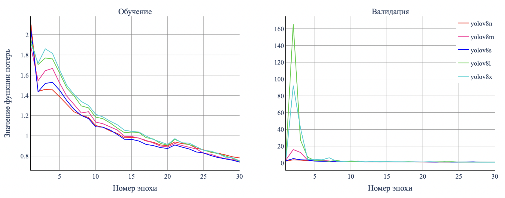

 

Графики обучения (функция потерь классификации):

  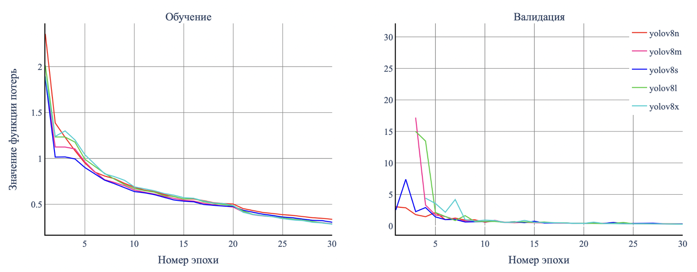

 

Графики обучения (метрики качества):

  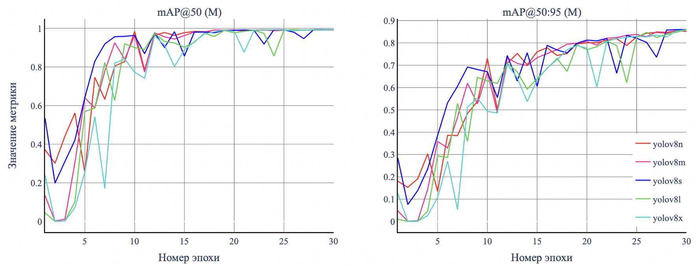

 

Наилучшие значения функции потерь сегментации (0.8766) и метрик качества (mAP@50 = 99.34%, mAP@50:95 = 86.04%) на последней эпохе валидации имеет модель yolov8s. Наименьшее значение функции потерь классификации (0.2936) имеет модель yolov8l, в то время как yolov8s достигла значения 0.3204. Для решения задачи распознавания и классификации дефектов из двух моделей предпочтение было отдано более легковесной модели yolov8s. 

### Создание двухстадийной системы по выявлению дефектов на упаковках груза 

После обучения алгоритмов для распознавания коробок на изображениях, а также выявления и классификации дефектов на них, обученные модели были объединены в двухстадийную систему. 

Алгоритм работы двухстадийной системы по выявлению дефектов на упаковочных коробках:

  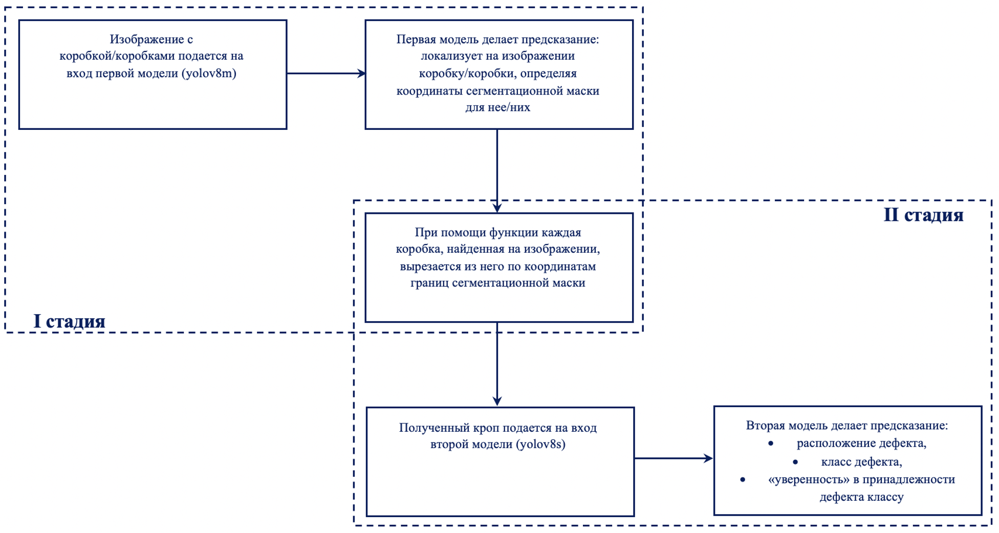

 
Применение разработанной системы к тестовым данным (ряд 1 – «открытая коробка», ряд 2 – «отверстие», ряд 3 – «вмятина»):

  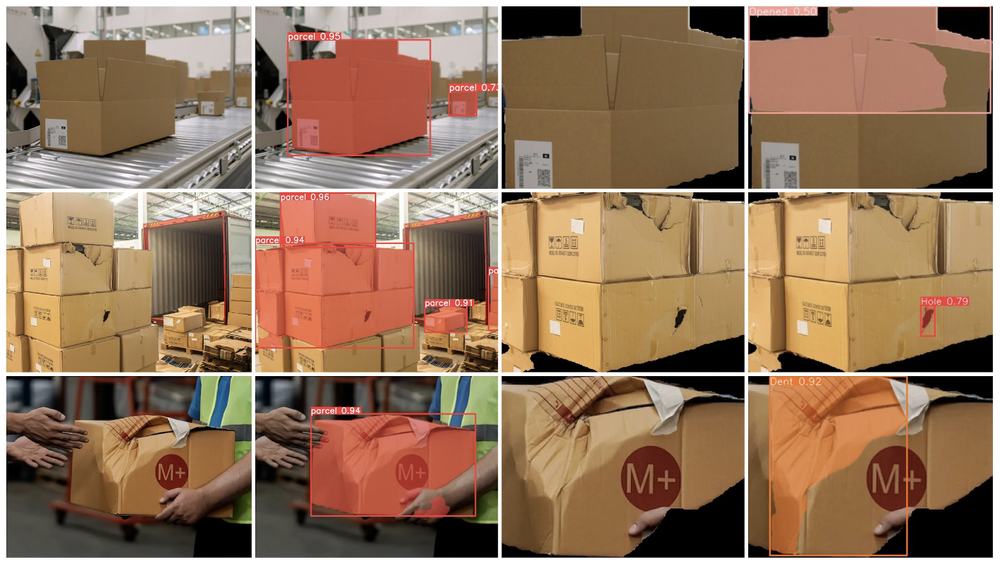

А) Исходное изображение, Б) Предсказание первой модели, В) Кроп коробки, Г) Предсказание второй модели

Анализ рисунка выявляет наличие ряда ограничений системы: 
1.	Система имеет пропуски, не все объекты распознаются.
2.	Объекты, расположенные вплотную друг к другу воспринимаются системой как один объект. Подобная ситуация возникает вследствие недостаточной репрезентативности обучающей выборки (отсутствие соответствующих примеров данных).
3.	Границы предсказанных сегментационных масок не всегда совпадают с истинными контурами целевых объектов (как коробок, так и дефектов).

Тем не менее, несмотря на указанные ограничения, система демонстрирует высокую эффективность в выявлении большинства дефектов и корректной классификации их типов, а также обладает достаточной степенью уверенности относительно своих предсказаний.

Обработка грузов при помощи системы осуществляется следующим образом:
1.	Поступающий в фулфилмент-центр груз подвергается проверке на наличие дефектов упаковки посредством системы. 
2.	После идентификации дефекта груз дополнительно проверяется сотрудником и отбраковывается в случае подтверждения наличия повреждения, после чего соответствующая информация передается поставщику.
3.	По решению поставщика отбракованная продукция возвращается отправителю, либо направляется на утилизацию, либо доставляется до потребителя.

Последующие этапы доработки системы, направленные на обеспечение способности системы обнаруживать до 99% повреждений грузов в будущем, предусматривают: 
1.	Дообучение применяемых алгоритмов на расширенном объеме тренировочных данных с целью повышения качества распознавания объектов и минимизации количества пропусков.
2.	Выравнивание баланса классов дефектов в обучающей выборке для повышения качества классификации.
3.	Дообучение алгоритмов на изображениях коробок с другими типами дефектов (например, «намокшая коробка»). 
4.	Интеграция алгоритмов трекинга либо индивидуального распознавания коробок по штрих-кодам для однозначной привязки выявленных дефектов к конкретным коробкам.
